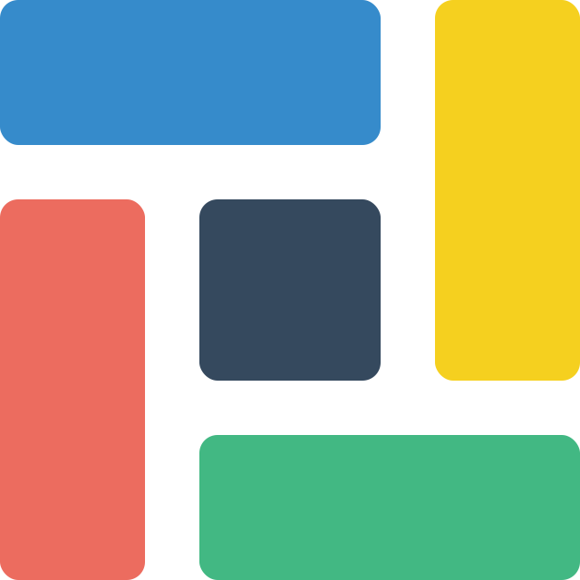

# vc-dock

<p align="center">
  
</p>

Dock Layout for Vue3 Component

 
<!--  -->

## Features

- 🚀 High performance
- 🌟 Easy to use
- 🎨 Fully customizable
- 📦 Minimal bundle size

## Installation

```bash
npm install vc-dock
```

## Examples

## Contributing

## FAQ

## Support

## License

This project is licensed under the MIT License - see the [LICENSE](./LICENCE) file for details.

## Acknowledgements

Inspired by [rc-dock](https://github.com/ticlo/rc-dock)
